# Algo_Trading
This project is an example of how to use trading signals with machine learning algorithms to most accurately forecast future data. In a fast paced trading environment using optimized machine learning models with algorythmic trading signals, allows for trade execution to be evaluated and executed at lightning speed.  This speed and forecast accuracy lead to profits, which is the goal of every financial trading organization.

---

# Technologies
Python implementation: CPython Python version : 3.7.13 

IPython version : 7.31.1

---

# Libraries and Modules
import pandas as pd

import numpy as np

from pathlib import Path

import hvplot.pandas

import matplotlib.pyplot as plt

from sklearn import svm

from sklearn.preprocessing import StandardScaler

from pandas.tseries.offsets import DateOffset

from sklearn.metrics import classification_report

---

# Project Steps

1. Establish a Model Baseline
    Import and prepare the data 
    Calculate trading signals
    Run the SVC classification model for baseline result

2. Optimize the Baseline Model
    Simple Moving Average window changes
    Training and testing set size changes

3. Trials of a Second Classification Model
    Evaluate performance compared to baseline
    
4. Evaluation Report

## Step 1: Establish a Model Baseline

- Import the `emerging_markets_ohlcv.csv` file from the Resources folder provided, and open into a pandas dataframe.

- Generate trading signals using short- and long-window SMA values.

- Split the data into training and testing datasets.

- Use the SVC classifier model from SKLearn's support vector machine (SVM) learning method to fit the training data and make predictions based on the testing data. Review the predictions and SVC model classification report.

- Create a predictions DataFrame that contains columns for “Predicted” values, “Actual Returns”, and “Strategy Returns”, then plot to show a baseline against which to compare the effects of tuning to the trading algorithm.

## Step 2: Optimize the Baseline Model 
- Choose one parameter of the model imput or settings to adjust and compare to the baseline for model for the the best cumulative products of the strategy returns.
    -- first the size of the Simple Moving Average Windows (short & long) were changed to different sizes, and the model was rerun to see the outcome    
    -- second the size of the training and testing sets where changed to see the outcome of the model's predictive performance

- Choose the best parameter sets for model optimization to be used for this model and the next classification model. See more details in Step 4: Evaluation Report 

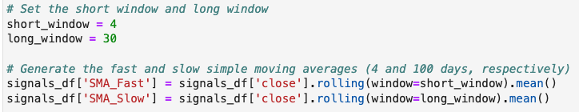

`training_end = X.index.min() + DateOffset(months=6)`

## Step 3: Trials of a Second Classification Model
- Choose a second classification model and compare it's predictive accuracy to the SVC model run.
    --This project choose the DecisionTree Classifier
    `from sklearn.tree import DecisionTreeClassifier`
    `clf = DecisionTreeClassifier(random_state=1)`
    
### Bonus: Trial of a Third Classification Model
- For comparison a third classification model was choosen to compare the predictive accuracy to the Decision Trees model and SVC
    --This project choose the kNearest Neighbor Classifier using 3 nodes
    
    `from sklearn.neighbors import KNeighborsClassifier`
    
    `kNN = KNeighborsClassifier(n_neighbors = 3)`
    
    --This model was run also run with a trial change in training and testing periods to see how the results of kNN would differ.

## Step 4: Evaluation Report

1. Many trials were run to find the best short and long window combination for the Simple Moving Average crossover trading strategy, to get as close as possible to the actual returns cumulative product sum.

Actual Returns Cumprod Sum = 4301

Strategy Returns Cumprod Sum Trials:

short window/ long window = cumulative product sum

4/100 = 2887

4/60 = 3092

12/100 = 2783

3/40 = 2691

**4/30 = 3327**

**best window ratio was comparing the short and long SMA crossover with a 4 day and 30 day SMA calculations**

2. Using this rolling window optimization, the parameters were then used in the SVC classifier model, trying different sized training and testing sets

- The first run used a training set of 3 months, and a testing set of 68 months: 

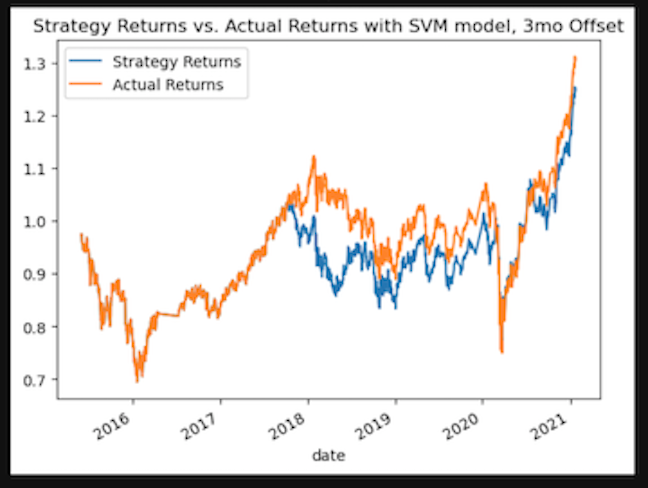

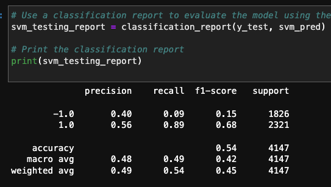

The model did well following the trends with the testing data, even when 2020 brought excess volitility. The actual returns just beat out the predicted returns, but the predicted returns followed the right trends.
The classification report showed a moderate accuracy score of 54%, meaning just over half of its total signal predictions were right. It did slightly better at predicting the buy signals (1)(precision 56%), than the sell signals (-1)(precision 40%). The recall showed the overwhelming correct 'buy' predictions at 89%, while the correct 'sell' predictions were only 9%.  This bias works well in the dataset we were working with, but may become a problem in a down market.  More testing should be done with additional datasets to see if this bias is an advantage or disadvantage.

- The second run used a training set of 6 months, and a testing set of 75 months:

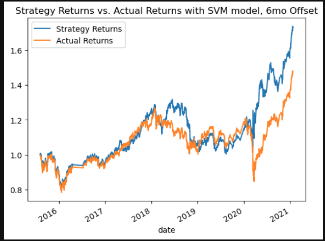

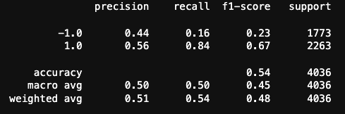

The model improved slightly by increasing the testing set data. The strategy predicted returns, beat the actual returns in this run, which can be seen in the plot.
The classification report showed the same accuracy score of 54%, meaning just over half of it's total signal predictions were right. I think the difference is the predictions were right in critical places, allow the model to improve. It performed the same at predicting the buy signals (1)(precision 56%) from the total predictions, while the longer testing set allowed the model to better predict the 'sell' signals (-1)(precision 44%) from all the predictions. The recall showed a slight decrease in the correct 'buy' predictions at 84%, while the correct 'sell' predictions increased by almost 10%, to 16%.

- The third run used a training set of 12 months, and a testing set of 59 months:

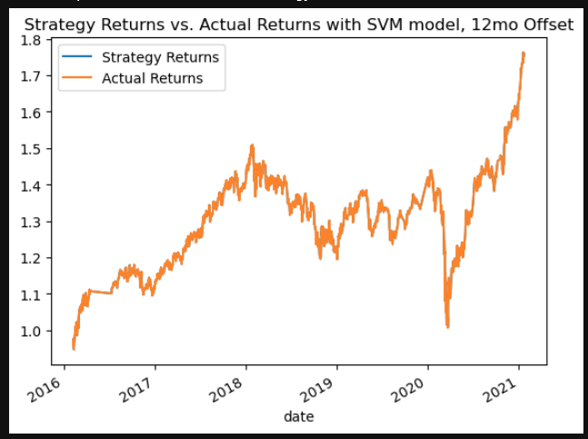

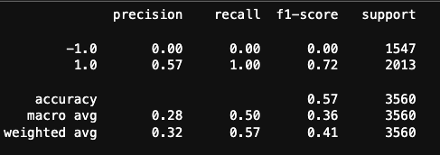

The model fit the data so well in this run that the predicted returns exactly matched the actual returns. However this is an indicator of over-fitting the model, as we see in the classification report.
The classification report showed the higest accuracy score of 57%, meaning over half of it's total signal predictions were correct. Infact when we look at the precision and recall numbers we see why. It completely missed all of the (-1) 'sell' class 0%, and correctly predicted the (1) 'buy' class 100%. Since the number of actual (1/-1)'buy'/'sell' ratio was 2416/1877, prediciting (1)'buy' through the entire data set it was able to reach a precision of 57% because 57% of the total data was (1) class. 

*I also tried running the model with a 50 month training set, and 21 month testing set. The results were nearly the same as the 12/59month split listed above*

After testing with all three different training/testing timeframes. I found the 6 month training dataset to produce the best predictive model optimization.

3. Review of different ML Classification models

For this project I tested 3 different models, the SVC Classifier from the Support Vector Machine, the Decision Trees Classifier, and the kNearest Neighbors classification model.

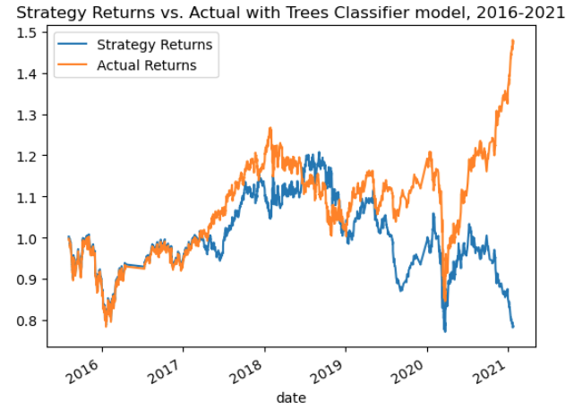

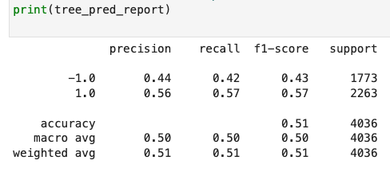

The Decision Tree Classifier did pretty well predicting signals. Recalibrating after the excess volitility in early 2020 seemed to be a challenge for this model, ask can be seen by the divergence in actual returns vs strategy returns for the last 6-7 month forecast period.  
The classification report showed an average accuracy score of 51%, meaning just over half of it's total signal predictions were right. I think the difference is the predictions were wrong in critical places causing the ending returns predition to be quite low. It performed the same as the SVC model at predicting the buy signals (1)(precision 56%) and 'sell' signals (-1)(precision 44%) from the total predictions. The recall numbers indicate a much better outcome of predicting (-1) 'sell' signals (42%), however these look to be clustered as volitility increased causing over selling in the model results. 

**BONUS**
For curiosity sake, I tried the kNearest Neighbor Classification model with the 6 month training dataset(kNN), and a 36 month training set (kNN2), just to compare the results to the other two models.

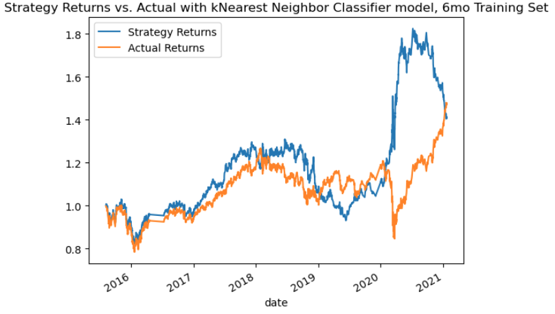

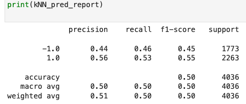

In general, the kNN model did well at predicting strategy returns better than the actual returns. It seemed to veer off with the excess volitility in early 2020, however ended with strategy returns almost equal to the actual returns by a year later.
The classification report numbers were well balanced for finance with a 50% accuracy, 44% / 56% precision, and 46% /53% recall.
 
 
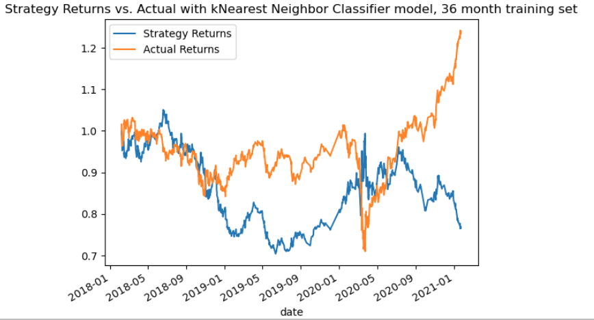

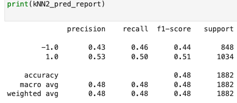

I was curious what would happen if with the kNN model if I really increased the testing set. Would it better handle the run in with excess volitility? The answer was definitely not.  The performance of this model deteriorated significantly with the excess training data, as can be visualized in the plot above.

Overall, best fit model for this data set: SVC model with a 6 months of training data.